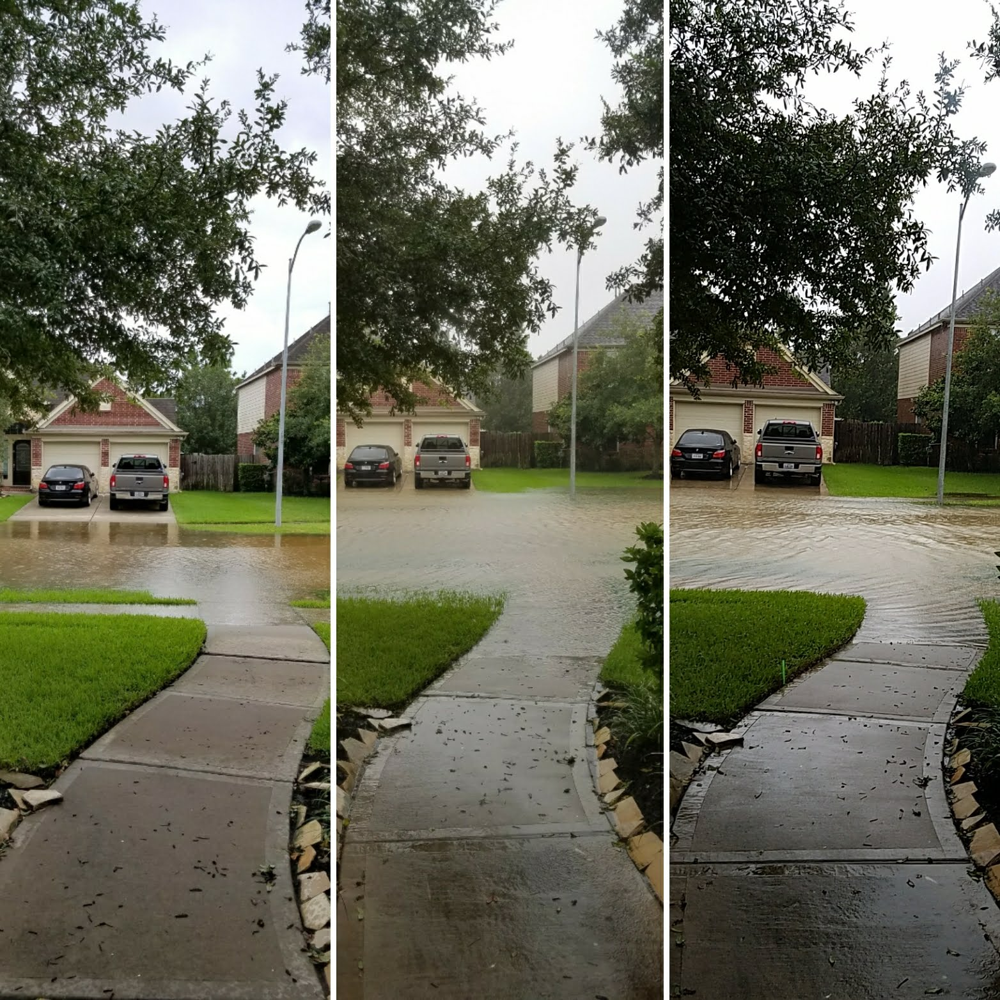

## What can average people do to help meteorologists?

### Flight through a Hurricane

Flight 2720 is a straight shot to Houston, about four hours and fifteen minutes. On a normal summer evening, *FIXME* the clouds would hang low and the sunset beamed colorful rays through the window as the airplane landed quietly at Hobby International Airport.

With this flight, a crack of lightning flashed across the sky, but no thunder followed. My flight had been calm, up to this final push. On occasion, I get nervous flying through a storm, but today’s pilots kept the plane sailing smoothly through the sky despite the ruckus immediately around us. This ruckus was just beginning to hit Houston--Hurricane Harvey.

Originally, I was slightly concerned about flying from Boston, Massachusetts, to Houston, Texas because of the impending weather. Harvey began formation in the Gulf of Mexico just a few days prior and loomed closer as its path shifted, projecting onto Houston. Now, it was here.

Anxious for the safety of the personnel and passengers, the airport sought to evacuate everyone as quickly as possible, not even taking my luggage off of the plane. As I walked through the airport, I decided that Sunday morning, maybe Sunday afternoon, I would leave to return to College Station to be there for the first day of university classes.

Exiting the building, my dad brought the small Honda Civic instead of the tall Ford “Built Tough” Truck. Rain pelted the car as we drove off into the storm. We only technically live thirty minutes from the airport, but we had to drive very carefully with the rising waters.

Lighting flashed, thunder cracked, rain poured. Why Dad didn’t bring the truck, I’ll never know. We were the only ones on the road. I could almost imagine the car stuck at the top of Beltway 8,  water encircling us, with the news helicopter flying above us, pointing their spotlight, broadcasting that there were another set of idiots trying to drive around town during a hurricane.

Despite my worries, we made it home safely. Once inside, I decided to stick to my original plan to head to College Station, unless something drastic changed. I had experienced hurricanes and flooding before. In my neighborhood, we were built with good drainage systems and retention ponds. I felt confident I could wake up in the morning and the roads clear to drive, as I had experienced with previous severe weather.

*Map #1*

### Hurricanes

In the Caribbean, tropical storms category begin at 34 mph, while hurricane categories exceeds 74 mph. These classifications come from the *Saffir-Simpson Hurricane Wind Scale*, which depends on wind speeds alone to slot storms into different categories. There's a trick to hurricanes, however. A number of factors affect these violent storms creating dangerous situations, not just wind speed.

Factors include the physical size of the storm and the amount of precipitation during the meteorological event. Hurricane Ike, for example, had the wind speed of a typical Hurricane _Category 2_, but the storm surge comparable to a typical _Category 5_. Hurricane Harvey was a _Category 4_ hurricane, with a wind speed of 130 mph. As a result, I knew the categorization system was flawed and thought

> Oh, because of my experiences with a hurricane that behaved like a Category 5, I know how to handle all hurricanes smaller than a Category 5.

My experiences with Ike, however, would not compare to Harvey in the slightest.

### Raining Continues

The precipitation for Harvey was unlike any other hurricane, dropping 27 trillion gallons over the first 6 days. Hurricane Katrina, by comparison, only dropped 6 trillion gallons of water.[^1] When I woke up the next morning, my street, which rarely floods, was filled over the brim. In fact, it was creeping into my lawn. The best I could do was take pictures from nearly the same spot to demonstrate how high the water was.

Scrolling through social media feeds, I saw my friends and family sharing similar photos of their streets and lawns. At the time, that's the best we had to measure how much rain had fallen. Needless to say, I wasn't leaving for college with how much rainfall had occurred. There was too much flooding.

My family and I just watched the social media feeds of other people's flood stories, and watched our lawn waiting for the rain to recede. After a few days, the storm left and the floodwaters drained. I drove off to College Station without another thought about the rain.

### Looking at the Hurricane in Retrospect

When presented with a data-based project for an English class, my thoughts then turned back to the unusual rainfall from Harvey. Somewhere, someone had to have recorded the data.

After some searching, I found a pretty comprehensive list of the entire rainfall for the weather event, from formation to dissipation. The data listed over 6900 sources, a different location across the nation that recorded rainfall data. Some sources, such as a local Dallas network of airports, made sense. But one data source, CoCoRaHs, contributed 6750 sets of data for the hurricane. Expansive, the data ranged from Texas to Maine. Who was this source?

*Map #2*

With the help of the internet, I was able to dig up some information about CoCoRaHS. A private network of volunteers, CoCoRaHS (Community Collaboration Rain, Hail, and Snow Network) is a non-profit network of volunteers across all fifty states working towards recording accurate rain data. Volunteers typically place a rain gauge in their backyard, observe the collected rain, and document the data in an online portal.

After a deadly flood in Colorado,[^2] CoCoRaHS was created to encourage communities to engage in citizen meteorological projects by recording weather observations. This data the CoCoRaHS network supplies empower everyone from local weathermen and city utilities to large organizations like the National Weather Service and the USDA for a variety of research and informational uses.

Everyone is encouraged to participate in the program--families, schools, scientists.[^3] The data collected by individuals across the nation go into individual, daily precipitation report. From there, the organization compiles them into a Public Information Statement that can be used by the public and media where other organizations interested in the data can use it.

The map above illustrates the rainfall data collected for the entire duration of Hurricane Harvey. If you zoomed in onto an individual point, it's not very interesting. You will just see a blue dot. However, when zooming out and seeing the network of data working together to create a comprehensive picture, you can see that with all of the individual precipitation records work together to communicate how rainfall affects the community as a whole. With an encompassing dataset, meteorologists and weathermen can more accurately provide weather information to prepare people for all kinds of weather.

### Joining CoCoRaHS
To join the organization, there are a few steps to be undertaken. After filling out a general form, purchasing a standard four inch rain gauge, and some training in how to read your new gauge, a person is able to help contribute rainfall information for their community. After learning how to measure precipitation accurately and consistently, the gauge and participant are ready to go. Measuring rainfall data helps support your local weather station with scientific data to make more accurate forecasts.

If you're interested in learning more about citizen weather science, visit your local weather station for opportunities to learn more about meteorology such as:[^4]
  * Jet Stream, an online introductory textbook to meteorology
  * SKYWARN, training to become a storm spotter for severe weathermen
  * Emergency Preparedness Seminars, to become informed about local emergency preparedness situations



##### Footnotes:

[^1]: https://www.cnn.com/2017/08/27/us/harvey-impact-by-the-numbers-trnd/index.html

[^2]: https://www.cocorahs.org/Content.aspx?page=aboutus

[^3]: http://www.upr.org/post/shower-national-weather-service-data-being-backyard-weather-observer.

[^4]: https://www.forbes.com/sites/dennismersereau/2018/07/31/8-fantastic-resources-to-learn-more-about-the-weather/#7f7c40f07dfa

---

<!--MAPS-->

